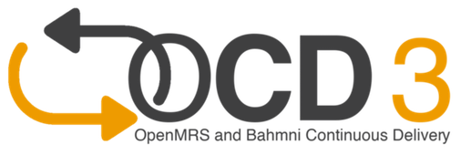

# OpenMRS CD 3 (OCD3)
> A dockerized [Jenkins](https://jenkins.io/) server ready to manage dockerized [OpenMRS](https://openmrs.org/) and [Bahmni](https://www.bahmni.org/) instances.

OCD3 in a nutshell:
* Builds and deploys all OpenMRS or Bahmni related software artifacts.
* Provides a definition framework for OpenMRS and Bahmni servers.
* Delivers server instances to Linux-powered hosts.
* Tracks code and configuration changes and propagates them to its managed server instances.

## Quick Start

The following steps describe a way to gather OCD3 artifacts locally and run the Docker container based on them. In a Un\*x shell:

**1** - Set the target version:
```bash
export VERSION=3.0.0-SNAPSHOT
```
**2** - Copy the artifacts out of the Nexus repo into the local Maven repo:
```bash
mvn dependency:get \
  -DgroupId=net.mekomsolutions \
  -DartifactId=openmrs-cd \
  -Dversion=$VERSION \
  -Dpackaging=zip \
  -DremoteRepositories=https://nexus.mekomsolutions.net/repository/maven-public
```
**3** - Unpack everything into openmrs-cd on the home folder:
```bash
mvn dependency:copy -Dartifact=net.mekomsolutions:openmrs-cd:$VERSION:zip -DoutputDirectory=/tmp/ && unzip /tmp/openmrs-cd-$VERSION.zip -d /tmp/ && rm /tmp/openmrs-cd-$VERSION.zip && rsync -av --delete /tmp/openmrs-cd-$VERSION/ ~/openmrs-cd/ && rm -r /tmp/openmrs-cd-$VERSION
```

**4** - Run the `openmrscd` container:
```bash
docker run -dti --name openmrscd  -p 8080:8080 \
  -v ~/openmrs-cd/node-scripts:/opt/node-scripts \
  -v ~/openmrs-cd/jenkins_home:/var/jenkins_home \
  -v ~/openmrs-cd/app_data:/var/lib/openmrs_cd/app_data \
  mekomsolutions/openmrscd:$VERSION
```
After the container has started, the customized Jenkins instance will be accessible at [http://172.17.0.1:8080](http://172.17.0.1:8080) with the following credentials: **admin** / **password**.

Authorize 'jenkins' user to write to the app_data folder:
```bash
docker exec -it openmrscd \
  bash -c "sudo chown -R jenkins:jenkins /var/lib/openmrs_cd/app_data/"
```

**Attention:** _The app data folder will contain the CD's file-based database. Make sure to keep it in a safe location._

**5** - Setup your Maven repo:
You must configure the coordinates of your Maven repo if you intend to deploy your own Maven artifacts with the CD.
Launch the **artifact_repo.js** script to configure the artifacts repository credentials and artifacts upload URLs:
```bash
docker exec -it openmrscd \
  bash -c "cd /usr/share/jenkins/ && npm install && node artifact_repo.js"
```
And answer the prompted questions.

**Note:** _If you do not want to enter the artifacts repository URLs and authentication details by hand (through the CLI) you can just edit **usr/share/jenkins/artifact_repo_default.json** (see the default one [here](docker/config/artifact_repo_default.json) as an example) with your own repo URLs and ID and then run the script again. It will detect the file and ask you to use it._

## Developer Guide

>OCD3 is a Dockerized Jenkins with preconfigured jobs. Those jobs run Node JS scripts or Node-generated Bash scripts.

This explains the structure and content of the root folder of the project:

```
.
├── docker
├── jenkins
└── node-scripts
```
**node-scripts** is the Node JS scripts area, **docker** holds the Dockerfile (and other resources needed to configure the container) and **jenkins** contains the parts of Jenkins home that are preconfigured, as well as the pipelines' Jenkinsfiles.

Gradle is used to run all build tasks and package all artifacts that make OCD3.

### Working out of the sources directly

When developing on the CD the best is to mount the Docker volumes right out of the sources.

**1** - Clone the openmrs-cd repository:

**Note:** _we assume that cloned repositories should go into the home `~/repos` folder. Adapt the commands below in accordance to your own local setup._
```bash
mkdir -p ~/repos && cd ~/repos && \
  git clone https://github.com/mekomsolutions/openmrs-cd && cd openmrs-cd
```
**2** - Build the Node scripts:
```bash
gradle node-scripts:build
```

**3** - Run the `openmrscd` container based on the `latest` tag:
```bash
docker run --name openmrscd  -p 8080:8080 \
  -v ~/repos/openmrs-cd/node-scripts:/opt/node-scripts \
  -v ~/repos/openmrs-cd/jenkins/jenkins_home:/var/jenkins_home \
  -v ~/.m2:/var/jenkins_home/.m2 \
  -v ~/Documents/openmrs-cd/app_data:/var/lib/openmrs_cd/app_data \
  mekomsolutions/openmrscd:latest
```
The last two mounted volumes are 'nice to have', they ensure that the CD reuses your local .m2 and that the app data are extracted out of the container to some convenient location. In its most minimal form however the above Docker command becomes:
```bash
docker run --name openmrscd  -p 8080:8080 \
  -v ~/repos/openmrs-cd/node-scripts:/opt/node-scripts \
  -v ~/repos/openmrs-cd/jenkins/jenkins_home:/var/jenkins_home \
  mekomsolutions/openmrscd:latest
```

### The 'node-scripts' component
Developing on OCD3 means working in here most of the time.
That is because the bulk of the logic of what OCD3 does lives here. Almost all Jenkins jobs are built on the following pattern:
>Jenkins jobs run Node scripts that generate Bash scripts that in turn perform the core CD tasks.

This is how one would build the underlying Node JS scripts:
```bash
gradle node-scripts:build
```
And this must be done before submitting code commits.
However note that the code base is not really built into anything since the container links directly to **/node-scripts**, but this formats the code and runs the test suite.

A detailed developer guide about the Node scripts can be found [here](readme/node-scripts/README.md).

### The 'docker' component
See [here](readme/docker/README.md).

### The 'jenkins' component

OCD3 not only needs a Docker image for its binaries but also requires a 'Jenkins home' folder that provides a pre-configured Jenkins setup:

```bash
gradle jenkins:build
```
This will package a zip archive of the jenkins folder.

**Note:** _Developing with the jenkins component may require to use `git clean -Xdf` from time to time. Please read the [note for developpers](readme/jenkins/README.md) first._

### The parent project (root folder)

Finally it is possible to build everything at once from the root level:
```bash
gradle build
```
This will cascade down to all child builds and run them.
